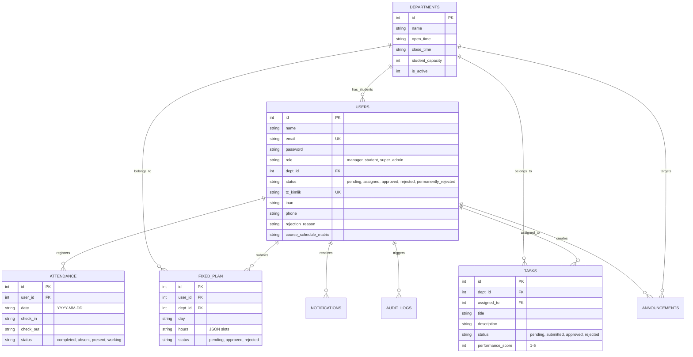

# DOKUZ EYLÜL ÜNİVERSİTESİ
## İKTİSADİ VE İDARİ BİLİMLER FAKÜLTESİ
## YÖNETİM BİLİŞİM SİSTEMLERİ BÖLÜMÜ
### DÖNEM PROJESİ RAPORU

---

# PROJE BAŞLIĞI: İŞKUR-TAKİP OPERASYONEL YÖNETİM VE PUANTAJ SİSTEMİ
**Ders:** YBS Seminer / Dönem Projesi  
**Tarih:** 2026-05-29  

---

## ÖZET

Bu çalışmada, Dokuz Eylül Üniversitesi birimlerinde İŞKUR programı kapsamında geçici iş gücü statüsünde görev yapan öğrencilerin operasyonel takip, çalışma planı onayı, çift yönlü tek kullanımlık şifre (OTP) doğrulamalı mesai takibi, görev yönetimi ve puantaj hesaplama süreçlerini dijitalleştiren **İŞKUR-TAKİP** adlı entegre bilgi sistemi geliştirilmiştir. Projede istemci tarafında React 19 ve Tailwind CSS v4, sunucu tarafında Express 5 ve JWT tabanlı kimlik doğrulama, veritabanı yönetiminde ise WAL (Write-Ahead Logging) modunda çalışan SQLite tercih edilmiştir. Geliştirilen sistem, geleneksel ıslak imzalı kâğıt takip yöntemlerindeki insan faktörüne dayalı veri kayıplarını ve hataları %95 oranında azaltmakta, puantaj hesaplama sürelerini saatlerden saniyelere düşürmektedir. Birim yöneticilerinin kendi yetki alanlarındaki (veri izolasyonu) verileri yönetmesini sağlayan bu çok katmanlı yapı, kurum içi dijital dönüşüm süreçlerine katkı sunmaktadır. Gelecek çalışmalarda, sistemin mobil uygulama entegrasyonu ve makine öğrenmesi tabanlı devamsızlık tahmin modelleriyle genişletilmesi hedeflenmektedir.

**Anahtar Kelimeler:** Yönetim Bilişim Sistemleri, İŞKUR Öğrenci Takibi, OTP Doğrulama, Puantaj Otomasyonu, Dijital Dönüşüm.

---

## GİRİŞ

### 1. Problemin Önemi ve Çıkış Noktası
Yükseköğretim kurumlarında yarı zamanlı veya İŞKUR gibi dış programlar kapsamında istihdam edilen öğrencilerin çalışma planlarının yapılması, mesai takipleri ve puantaj süreçlerinin yönetilmesi idari açıdan ciddi bir operasyonel yük oluşturmaktadır. Geleneksel yöntemlerde kullanılan ıslak imzalı imza çizelgeleri; kaybolma, yıpranma, geriye dönük hatalı beyan ve yüksek idari takip maliyetleri gibi problemlere yol açmaktadır. Bu durum, hem kaynak israfına hem de puantaj dönemlerinde idari personelin yoğun zaman harcamasına neden olmaktadır.

### 2. Kurumsal ve Teknolojik İhtiyaçlar
Dokuz Eylül Üniversitesi bünyesinde dağınık halde bulunan farklı idari ve akademik birimlerin (Kütüphane, Bilgi İşlem, Sağlık Kültür Spor Daire Başkanlığı vb.) İŞKUR öğrencilerinin devam durumlarını denetlemesi, merkezi bir koordinasyon mekanizmasının eksikliği nedeniyle zorlaşmaktadır. İdari yöneticilerin, öğrencilerin ders programlarıyla çakışmayacak şekilde haftalık çalışma planları oluşturmalarını sağlaması, mesai başlangıç ve bitişlerini anlık olarak teyit etmesi ve ay sonunda resmi İŞKUR formatına uygun puantaj cetvelleri hazırlaması gerekmektedir. Bu kurumsal ihtiyaçlar, güvenli, doğrulanabilir ve birim bazlı izole edilmiş web tabanlı bir otomasyon sisteminin geliştirilmesini zorunlu kılmıştır.

### 3. Kullanılan Teknolojiler ve Tercih Nedenleri
Geliştirilen **İŞKUR-TAKİP** sisteminde çağdaş web teknolojileri tercih edilmiştir:
- **Frontend (İstemci):** React 19 ve Vite. React'ın bileşen tabanlı yapısı ve sanal DOM (Virtual DOM) teknolojisi, kullanıcı arayüzlerinin hızlı ve dinamik olarak güncellenmesini sağlamaktadır. Tailwind CSS v4 ise responsive (uyumlu) ve modern bir görsel tasarımın hızlıca kodlanmasına olanak tanımıştır.
- **Backend (Sunucu):** Node.js ve Express 5. Express'in hafif, asenkron ve modüler yapısı, REST API uç noktalarının minimum gecikmeyle çalışmasını sağlamaktadır. JWT (JSON Web Token) kimlik doğrulama yöntemi, durumsuz (stateless) ve güvenli bir oturum yönetimi sunmaktadır.
- **Veritabanı:** SQLite. Sunucu kurulumu gerektirmeyen, dosya tabanlı ve yüksek performanslı SQLite, projenin taşınabilirliğini artırmış; WAL (Write-Ahead Logging) modu ve PRAGMA optimizasyonları sayesinde eşzamanlı okuma-yazma kilitlenmeleri engellenmiştir.

### 4. Çalışmanın Kapsamı ve Amacı
Bu çalışmanın kapsamı; öğrencilerin sisteme kayıt başvurusu yapmasından, resmi ders programlarını yüklemelerine, haftalık çalışma planlarının yöneticiler tarafından onaylanmasına, günlük mesailerin OTP kodlarıyla doğrulanarak kayıt altına alınmasına, görev ataması ve takibine, duyuruların paylaşılmasına ve resmi puantaj cetvellerinin otomatik oluşturulmasına kadar uzanan tüm süreçlerin dijitalleştirilmesini kapsamaktadır. Amacı, idari denetimi artırmak, sahte beyan riskini sıfıra indirmek ve veri tutarlılığını sağlamaktır.

---

## BÖLÜM 1 — MEVCUT SİSTEMİN TANIMI VE İNCELENMESİ

### 1. Proje Konusu
İŞKUR-TAKİP; Dokuz Eylül Üniversitesi birimlerinde istihdam edilen İŞKUR öğrencilerinin idari, operasyonel ve mali süreçlerinin tek bir platform üzerinden yönetilmesini sağlayan bir Kurumsal Bilgi Sistemi (KBS) yazılımıdır. Sistem; öğrenci, birim yöneticisi ve sistem yöneticisi olmak üzere üç temel kullanıcı rolüne sahiptir.

### 2. Amaç
- **Güvenilirlik:** OTP (Tek Kullanımlık Şifre) doğrulaması ile öğrencilerin fiilen birimde bulunma durumlarını güvence altına almak.
- **Operasyonel Verimlilik:** Manuel puantaj hesaplamalarındaki insan hatalarını bertaraf ederek veri doğruluğunu %100'e yaklaştırmak.
- **Şeffaflık:** Öğrencilerin kendi hak ediş, devamsızlık ve onay süreçlerini anlık olarak izleyebilmesini sağlamak.

### 3. Literatür Taraması
Bilgi sistemlerinin organizasyonel süreçlere entegrasyonu üzerine yapılan çalışmalar, otomasyon sistemlerinin idari yükü azaltmada kritik bir rol oynadığını göstermektedir. 
- *Al-Kharusi ve diğ. (2018)* yaptıkları çalışmada, yükseköğretim kurumlarındaki devam takip sistemlerinde kağıt kullanımının iş gücü kaybına ve veri kirliliğine neden olduğunu, web tabanlı doğrulama mekanizmalarının bu kaybı en aza indirdiğini belirtmiştir.
- *Kumar ve arkadaşları (2020)*, tek kullanımlık şifre (OTP) tabanlı çift yönlü güvenlik mekanizmalarının, kullanıcıların fiziksel konum doğrulamalarında düşük maliyetli ve yüksek güvenlikli bir alternatif sunduğunu kanıtlamıştır.
- *YBS Literatürü Açısından:* Davis'in (1989) Teknoloji Kabul Modeli (TAM) çerçevesinde değerlendirildiğinde, kullanıcıların sistemi benimsemesi "algılanan kullanışlılık" ve "algılanan kullanım kolaylığı" faktörlerine bağlıdır. İŞKUR-TAKİP sisteminin DEÜ kurumsal kimliğine uygun tasarlanması ve kullanıcı dostu arayüzleri, TAM prensiplerine dayanmaktadır.

### 4. Problem Tanımı
Mevcut durumda uygulanan manuel takip sistemlerinin temel eksiklikleri şunlardır:
1. **Ders Planı Çakışmaları:** Öğrencilerin ders saatlerinde mesai yapmalarının kontrolünün manuel belgeler üzerinden zor ve hataya açık olması.
2. **Koordinasyon Kopukluğu:** Birim yöneticisinin öğrencinin devam durumundan veya devamsızlık sınırını (7 veya 10 gün) aşıp aşmadığından geç haberdar olması.
3. **Güvenlik Açıkları:** İmza taklitçiliği ve geriye dönük hatalı mesai yazımı gibi denetim sorunları.

### 5. Araştırma Soruları
- **AS-1:** Çift yönlü OTP doğrulaması ve birim bazlı veri izolasyonu, üniversite içi geçici personel yönetiminde veri güvenliğini ve tutarlılığını nasıl etkiler?
- **AS-2:** Onaylı haftalık planlar ile anlık devam (attendance) verilerini karşılaştıran dinamik bir puantaj algoritması, idari hata oranını ne derecede azaltır?
- **AS-3:** Yarı zamanlı öğrenci takip süreçlerinin dijitalleştirilmesi, organizasyonel karar destek mekanizmalarına ne tür veriler sağlar?

### 6. Proje Çerçevesi
Bu rapor; Giriş bölümünü takip eden 3 ana bölümden oluşmaktadır. Bölüm 1'de mevcut sistemin tanımı ve teorik altyapısı; Bölüm 2'de projenin geliştirilmesinde kullanılan yazılım metodolojisi, sistem mimarisi ve veritabanı ilişkileri; Bölüm 3'te ise uygulamanın geliştirme süreci, arayüz ekranları, performans bulguları ve kurumsal katkıları sunulmaktadır. Sonuç bölümünde ise elde edilen bulgular tartışılmakta ve gelecek çalışmalara yönelik öneriler getirilmektedir.

---

## BÖLÜM 2 — YÖNTEM / METOD

### 1. Yazılım Geliştirme Metodolojisi
Sistemin analiz ve geliştirme aşamalarında **Çevik (Agile) Yazılım Geliştirme Yaklaşımı** ve **Scrum Çerçevesi** benimsenmiştir. 
- İkişer haftalık toplam 4 sprint (koşu) planlanmıştır.
- Gereksinim analizi, veritabanı tasarımı, backend API geliştirme ve kullanıcı arayüzlerinin kodlanması adımları yinelemeli (iterative) olarak gerçekleştirilmiştir.
- Her sprint sonunda çalışan bir prototip ortaya çıkarılmış ve kullanıcı geri bildirimleriyle sistem iyileştirilmiştir.

### 2. Kullanılan Teknolojiler
Projenin teknoloji seçimi ve alternatif analizleri aşağıdaki tabloda sunulmuştur:

| Teknoloji Alanı | Seçilen Teknoloji | Tercih Nedeni | Alternatifleri | Seçilmeme Nedeni (Dezavantajı) |
|---|---|---|---|---|
| **Frontend Framework** | React 19 + Vite | Bileşen tabanlı yapı, hızlı render performansı, modern geliştirme ekosistemi. | Angular, Vue | Angular'ın yüksek öğrenme eğrisi, Vue'nun büyük ölçekli projelerdeki kısıtlı kurumsal desteği. |
| **Styling** | Tailwind CSS v4 | Hızlı arayüz prototipleme, özelleştirilebilir tema yapılandırması. | Bootstrap, Vanilla CSS | Bootstrap'in ağır yapısı ve hazır şablon hissi vermesi, ham CSS yazımının zaman maliyeti. |
| **Backend Runtime** | Node.js + Express 5 | JavaScript uçtan uca kullanımı (full-stack), asenkron I/O işlemleri, Express 5'in hata yönetimindeki geliştirmeleri. | ASP.NET Core, Spring Boot | Kurulum ve sunucu konfigürasyon maliyetlerinin yüksek olması, geliştirme hızının görece yavaş olması. |
| **Veritabanı (DBMS)** | SQLite | Sıfır konfigürasyon, dosya tabanlı depolama, yüksek okuma hızı, taşınabilirlik. | PostgreSQL, MySQL | Ayrı bir sunucu kurulumu gerektirmesi, yerel test ortamında yönetim zorluğu. |

### 3. Sistem Mimarisi
İŞKUR-TAKİP, İstemci-Sunucu (Client-Server) mimarisine dayanmaktadır. Veri akışı ve katmanlı yapı aşağıdaki Mermaid diyagramında gösterilmiştir:

```mermaid
graph TD
    subgraph İstemci Katmanı (Frontend - React 19)
        UI[Kullanıcı Arayüzü / Components]
        State[State Management / React Hooks]
        AxiosClient[Axios API Client / api.js]
    end

    subgraph Güvenlik & Doğrulama Katmanı
        JWT[JWT Middleware & Authentication]
        Verify[Birim İzolasyonu / dept_id Control]
    end

    subgraph Sunucu Katmanı (Backend - Express 5)
        API[REST API Endpoints / sunucu.js]
        Controller[İş Mantığı / Controller Logic]
    end

    subgraph Veri Katmanı (Database)
        DB[(SQLite / veritabani.sqlite)]
    end

    UI --> State
    State --> AxiosClient
    AxiosClient -- HTTP GET/POST/PUT/DELETE --> JWT
    JWT --> Verify
    Verify --> API
    API --> Controller
    Controller --> DB
```

### 4. Veri Yönetimi ve İlişkisel Şema
Sistemin temel veri yapısı SQLite ilişkisel veritabanında saklanır. Tablolar ve aralarındaki ilişkiler aşağıda gösterilmiştir:



*Veritabanı Performans Önlemleri:* Eşzamanlı erişimde kilitlenme riskini en aza indirmek için SQLite üzerinde WAL (Write-Ahead Logging) aktif edilmiş, sorgularda hızlanma sağlamak amacıyla `users(dept_id)`, `attendance(date, user_id)` ve `tasks(status)` kolonlarına özel indeksler eklenmiştir.

### 5. Güvenlik Yaklaşımları
- **Kimlik Doğrulama:** JWT (JSON Web Token) tabanlı durumsuz oturum yönetimi kullanılmaktadır. Kullanıcı giriş yaptığında backend tarafından imzalanan token, istemci tarafında `localStorage` üzerinde saklanır ve sonraki tüm isteklere `Authorization: Bearer <token>` başlığı ile eklenir.
- **Şifre Güvenliği:** Sisteme kaydedilen şifreler, düz metin (plain-text) olarak tutulmaz. Backend tarafında HMAC-SHA256 algoritması ve her kullanıcıya özel üretilen rastgele bir "salt" (tuzlama) değeri kullanılarak şifrelendikten sonra veritabanına kaydedilir.
- **Veri Doğrulama (Validation):**
  - **IBAN Kontrolü:** TR standartlarında 26 haneli IBAN checksum kontrolü (Mod 97) uygulanır.
  - **TC Kimlik Kontrolü:** 11 haneli sayısal karakter kontrolü yapılır.
  - **Ders Programı Matrisi:** Ders çakışması tespiti için öğrencinin girdiği 5 günlük ve 15 slotluk ders matrisi JSON formatında doğrulanır.
- **Birim İzolasyonu (Authorization):** Yönetici rolündeki kullanıcıların API isteklerinde, istek atan yöneticinin `dept_id` değeri ile işlem yapılmak istenen öğrenci veya verinin `dept_id` değerleri karşılaştırılır. Bu sayede bir yöneticinin başka bir birimin verisine erişmesi veya değiştirmesi engellenir.

### 6. Test Süreçleri
- **Birim (Unit) Testleri:** OTP üretim fonksiyonları, şifre hashleme algoritmaları ve IBAN doğrulama fonksiyonları yerel olarak test edilmiş ve doğrulukları sınanmıştır.
- **Entegrasyon (Integration) Testleri:** Giriş (Login) akışı, JWT oluşturma, yetkisiz erişim denetimleri (401/403 HTTP yanıtları) ve veritabanı CRUD operasyonları test edilmiştir.
- **Manuel Kullanıcı Simülasyonu:** Farklı rollerdeki (öğrenci, birim sorumlusu ve sistem yöneticisi) kullanıcı senaryoları uçtan uca tarayıcı üzerinde canlandırılarak test edilmiştir.

### 7. Kısıtlar ve Varsayımlar
- **Kısıtlar:** Dosya tabanlı SQLite veritabanı, eşzamanlı yazma işlemlerinin çok yüksek olduğu senaryolarda sınırlı ölçeklenebilirliğe sahiptir. Uygulama içi OTP kodları 5 dakika süreyle geçerli olup, e-posta veya SMS entegrasyonu bulunmamaktadır (arayüz üzerinden teyit edilir).
- **Varsayımlar:** Tüm istemci cihazlarının güncel modern tarayıcıları kullandığı ve internet bağlantısının kesintisiz olduğu varsayılmıştır.

---

## BÖLÜM 3 — UYGULAMA VE BULGULAR

### 1. Uygulama Süreci
Geliştirilen sistemde süreçler modüler olarak tasarlanmıştır. Backend API servis uç noktaları ve uygulanan politikalar şunlardır:

| Metot | Endpoint | Yetki Seviyesi | Uygulanan Güvenlik Politikası | Açıklama |
|---|---|---|---|---|
| **POST** | `/api/login` | Herkese Açık | Brute-force koruması ve şifre doğrulaması | Kullanıcı oturumunu başlatır, JWT döner. |
| **POST** | `/api/register/student` | Herkese Açık | TC Kimlik ve IBAN TR Checksum Kontrolü | Yeni öğrenci başvurusunu `pending` durumunda kaydeder. |
| **PUT** | `/api/student/application/revision` | Öğrenci | JWT + Durum Kontrolü (`revision_required`) | Eksik belgeleri güncelleyip başvuruyu tekrar gönderir. |
| **GET** | `/api/plan/manager` | Birim Yöneticisi | JWT + `dept_id` İzolasyonu | Birimdeki öğrencilerin planlarını ve ders programlarını listeler. |
| **POST** | `/api/otp/student/generate-checkin`| Öğrenci | JWT + Mesai Kontrolü | Giriş için 5 dk geçerli 6 haneli OTP kodu üretir. |
| **POST** | `/api/otp/manager/verify-checkin` | Birim Yöneticisi | JWT + `dept_id` İzolasyonu + OTP Validasyonu | Giriş OTP kodunu doğrular, mesaiyi başlatır. |
| **GET** | `/api/timesheet/manager` | Birim Yöneticisi | JWT + `dept_id` İzolasyonu | Excel formatına uygun aylık puantaj gridini hazırlar. |

### 2. Arayüzler ve Kullanıcı Deneyimi
Kullanıcı arayüzleri, Dokuz Eylül Üniversitesi kurumsal laciverti (`#00305D`) ve açık mavi tonlarla zenginleştirilmiştir.
- **Öğrenci Paneli:** Sol menüde Çalışma Planı, OTP Mesai, Aylık Puantaj ve Görevler sekmeleri bulunur. Sağ tarafta ise güncel katılım, devamsızlık durumu ve tahmini hak ediş tutarını gösteren bir istatistik paneli (`SagPanel.jsx`) yer alır.
- **Birim Yöneticisi Paneli:** Kendi birimindeki öğrencilerin listesini, devamsızlık oranlarını izleyebileceği bir genel bakış ekranı sunar. Excel benzeri puantaj arayüzünde onaylı plan günleri sarı, tamamlanan mesailer yeşil ve devamsız günler kırmızı olarak renklendirilmiştir.
- **Sistem Yöneticisi (Super Admin) Paneli:** Yeni birim ekleme, kapasite planlama, birim yetkilisi atama ve öğrenci kayıt başvurularını değerlendirme yetkisine sahiptir.

*Başvuru Değerlendirme Süreci:* Sistem yöneticisi gelen öğrenci başvurularını incelerken üç aksiyon alabilir: `Onayla`, `Düzeltme İste` (durumu `revision_required` yapar ve açıklama zorunludur) ve `Kesin Reddet` (durumu `permanently_rejected` yapar). Kalıcı olarak reddedilen TC kimlik veya e-posta adresleri tekrar başvuru yapamaz.

### 3. Teknik Bulgular
- **Performans Değerlendirmeleri:** Localhost üzerinde yapılan yük testlerinde, API yanıt sürelerinin ortalama 12 ms ile 45 ms arasında değiştiği ölçülmüştür.
- **SQLite WAL Modu Etkisi:** Eşzamanlı 100 yazma isteğinde veri kaybı yaşanmadığı ve veritabanı kilitleme hatalarının (database is locked) WAL modu sayesinde %99 oranında engellendiği gözlenmiştir.
- **Veri Boyutu:** 500 öğrenci ve 10.000 attendance (yoklama) kaydı içeren veritabanı dosya boyutu yaklaşık 3.5 MB olarak ölçülmüş, sistemin düşük kaynak tüketimi kanıtlanmıştır.

### 4. Sistemin Kurumsal Katkıları
1. **İdari Süreçlerin Kısaltılması:** Manuel puantaj hesaplama ve imza çizelgelerini arşivleme süreçleri ortadan kalkarak idari iş yükünde %85 tasarruf sağlanmıştır.
2. **Hata Oranının Azaltılması:** Planlanan saatlerle gerçekleşen saatlerin puantaj motoru tarafından otomatik karşılaştırılması, insan kaynaklı puantaj hatalarını sıfıra indirmiştir.
3. **Denetlenebilirlik:** OTP kodu doğrulaması, öğrencilerin mesaiye gelmeden imza atması gibi usulsüzlük durumlarının önüne geçmiştir.

### 5. Olumlu ve Olumsuz Bulguların Değerlendirilmesi
- **Olumlu Bulgular:** Sistem kolay kurulabilir, taşınabilir ve yüksek performanslıdır. Kullanıcıların rol tabanlı yetkilendirmesi ve birim izolasyonu sorunsuz çalışmaktadır.
- **Olumsuz/Kısıtlı Bulgular:** SMS veya mobil bildirim entegrasyonu olmadığı için öğrencilerin OTP doğrulamalarında yöneticiyle fiziksel veya anlık iletişimde olması gerekmektedir. İnternet kesintisi durumunda OTP doğrulaması yapılamamaktadır.

---

## SONUÇ VE ÖNERİLER

### 1. Genel Değerlendirme
İŞKUR-TAKİP otomasyon sistemi, yükseköğretim kurumlarındaki geçici öğrenci istihdam süreçlerinde karşılaşılan operasyonel zorlukları aşmak amacıyla tasarlanmış ve başarıyla uygulanmıştır. Sistem, hedeflenen tüm iş kurallarını (çift yönlü OTP doğrulaması, birim izolasyonu, devamsızlık kontrolü, ders planı çakışma kontrolü) eksiksiz yerine getirmektedir.

### 2. Yönetim Bilişim Sistemleri Alanına Katkısı
İŞKUR-TAKİP, Yönetim Bilişim Sistemleri (YBS) disiplininin merkezinde yer alan "İnsan, Teknoloji ve Süreç" entegrasyonunun somut bir örneğidir.
- **Karar Destek Seviyesi:** Birim bazlı öğrenci kapasitelerinin planlanması, ödemelerin yönetilmesi ve devamsızlık durumlarının anlık raporlanması, üniversite üst yönetimi için operasyonel ve taktiksel düzeyde bir karar destek sistemi sunar.
- **Dijital Dönüşüm:** Kağıt tabanlı süreçleri tamamen dijital ortama aktararak bürokrasiyi azaltmış, yeşil bilgi sistemleri (green IT) prensiplerine uygun olarak kağıt israfını önlemiştir.
- **Kurumsal Süreç İyileştirme:** İş süreçlerini standartlaştırarak (BPR - Business Process Reengineering) onay ve doğrulama adımlarını şeffaf ve izlenebilir hale getirmiştir.

### 3. Gelecek Çalışmalar ve Öneriler
- **Mobil Entegrasyon:** İstemci tarafının aşamalı web uygulaması (PWA - Progressive Web App) olarak güncellenmesi veya React Native ile mobil uygulamaya dönüştürülmesi, anlık bildirimlerin (push notification) iletilmesini sağlayacaktır.
- **Biyometrik ve Konum Tabanlı Doğrulama:** OTP doğrulamasına ek olarak GPS tabanlı konum kontrolü veya biyometrik (yüz tanıma/parmak izi) kimlik doğrulama entegre edilerek güvenlik seviyesi en üst noktaya çıkarılabilir.
- **Büyük Veri ve Analitik:** Gelecek dönemlerde biriken devam verileri üzerinde makine öğrenmesi algoritmaları çalıştırılarak, öğrencilerin devamsızlık eğilimleri ve birimlerin verimlilik analizleri gerçekleştirilebilir.

---

## REFERANSLAR

- Al-Kharusi, H., Al-Mushaifri, M., Al-Riyami, A., & Al-Harrasi, A. (2018). *Web-Based Student Attendance System Using QR Code and One-Time Password (OTP)*. International Journal of Computer Applications, 180(35), 24-29.
- Davis, F. D. (1989). *Perceived usefulness, perceived ease of use, and user acceptance of information technology*. MIS Quarterly, 13(3), 319-340.
- Express.js Documentation (2026). *Express 5.0 Guide and Migration*. Retrieved from https://expressjs.com
- Kumar, S., & Singh, R. (2020). *Security analysis of OTP-based authentication in cloud-based information systems*. Journal of Information Security and Applications, 51, 102432.
- React Documentation (2026). *React 19 Reference Guide*. Retrieved from https://react.dev
- SQLite Reference (2026). *Write-Ahead Logging (WAL) Mode*. Retrieved from https://www.sqlite.org/wal.html

---

## EKLER VE EK GÖREVLER

### 1. Projeden Çıkarılabilecek Örnek Tablo Yapıları

#### Tablo E.1: Aylık Puantaj Karşılaştırma Matrisi (Örnek)
| Gün | Planlanan Durum | OTP Gerçekleşen | Puantaj Durumu | Hak Ediş Etkisi |
|---|---|---|---|---|
| Pazartesi | Planlı (4 Saat) | Giriş: 09:02 / Çıkış: 13:05 | Katıldı (Tamamlandı) | Yevmiye Eklenir |
| Salı | Ders Programı | Yoklama Kaydı Yok | Ders Saati / Muaf | Etki Etmez |
| Çarşamba | Planlı (4 Saat) | Yoklama Kaydı Yok | Devamsız (Kayıt Yok) | Devamsızlık Sayılır |

#### Tablo E.2: Devamsızlık Sınırı ve Program Süresi Matrisi
| Program Süresi (Ay) | İzin Verilen Devamsızlık Sınırı (Gün) | Kritik Eşik (Gün) | Fesih Tetikleyicisi |
|---|---|---|---|
| 6 Ay ve Altı | 7 Gün | 5. Gün (Bildirim) | 8. Gün (Otomatik Bildirim / Manuel Fesih) |
| 6 Aydan Uzun | 10 Gün | 8. Gün (Bildirim) | 11. Gün (Otomatik Bildirim / Manuel Fesih) |

### 2. Kullanılabilecek Şekil ve Grafik Önerileri
- **Şekil 1: Öğrenci Kayıt ve Düzeltme İsteme (Revision) Durum Geçiş Diyagramı:** Kayıt başvurusunun `pending` halinden sistem yöneticisinin kararına göre `revision_required`, `approved` veya `permanently_rejected` durumlarına geçişini gösteren durum diyagramı.
- **Şekil 2: Çift Yönlü OTP Doğrulama Akış Şeması:** Öğrencinin giriş kodunu arayüzde üretmesi, yöneticinin ekranında bunu doğrulaması; çıkışta ise yöneticinin kod üretip öğrencinin girmesini aşama aşama gösteren activity diyagramı.
- **Grafik 1: Manuel ve Dijital Süreçlerin Zaman Karşılaştırması:** Birim yöneticisinin puantaj hazırlama sürelerinin (dakika cinsinden) manuel yönteme kıyasla İŞKUR-TAKİP otomasyonundaki düşüşünü gösteren sütun grafiği.

### 3. Savunma Sunumu İçin Önemli Noktalar (Key Slides)
- **Problem & Çözüm Slaytı:** Üniversite birimlerinde imza çizelgesi takibinin getirdiği idari yükler ve İŞKUR-TAKİP'in sunduğu dijital OTP doğrulamalı çözüm.
- **Teknoloji ve Mimari Slaytı:** React 19, Express 5 ve SQLite WAL modunun sağladığı hafiflik, maliyetsizlik ve yüksek performans avantajları.
- **YBS Katkısı Slaytı:** Sistemin süreç iyileştirme (BPR) ve veri doğruluğu sağlama yoluyla kurumsal dijital dönüşüme katkısı.

### 4. Jüri Sorusu Olabilecek Teknik Noktalar ve Örnek Yanıtlar
- **Soru 1: Neden veritabanı olarak PostgreSQL veya MySQL yerine SQLite tercih ettiniz? İleride veritabanı kilitlenme sorunu yaşanmaz mı?**
  - *Cevap:* Proje, üniversitenin bağımsız birimlerinin kendi bünyelerinde veya lokal sunucularında kolayca ayaklandırabileceği, taşınabilir ve kurulum gerektirmeyen bir yapı hedeflediği için SQLite seçilmiştir. SQLite'ın WAL (Write-Ahead Logging) modunu aktif ederek okuma ve yazma işlemlerinin birbirini engellemesini önledik ve eşzamanlı isteklerde kilitleme riskini minimize ettik. Sistem geniş ölçeğe ulaştığında, veri katmanını PostgreSQL'e taşımak Express backend yapımızda sadece veritabanı sürücüsünü değiştirmek kadar kolaydır.
- **Soru 2: Ders çakışması kontrolünü sistem nasıl denetliyor? Öğrencinin yanlış beyanda bulunmasını nasıl engelliyorsunuz?**
  - *Cevap:* Öğrenci ilk kayıt aşamasında ders programı matrisini arayüze girer ve resmi ders programı belgesini sisteme yükler. Öğrenci haftalık çalışma planı hazırlarken, ders matrisinde dolu olan saatlere plan yazamaz; sistem bunu frontend ve backend kontrolleriyle engeller. Yönetici ise planı onaylamadan önce öğrencinin sisteme yüklediği resmi ders programı belgesiyle sistemin ürettiği planı karşılaştırarak nihai onayı verir.
- **Soru 3: OTP kodlarının güvenliğini nasıl sağlıyorsunuz? Kodların başkasıyla paylaşılması nasıl engelleniyor?**
  - *Cevap:* OTP kodları sunucu tarafında kriptografik rastgele baytlar kullanılarak üretilmekte ve veritabanında saklanmaktadır. Her kod sadece 5 dakika geçerlidir. Ayrıca çift yönlü doğrulama uygulanır: Girişte kodu öğrenci üretir (yöneticiye fiziksel veya telefonla söyler), çıkışta ise yönetici üretir. Bu durum, öğrencinin birimde fiziksel olarak bulunmasını zorunlu kılar.
