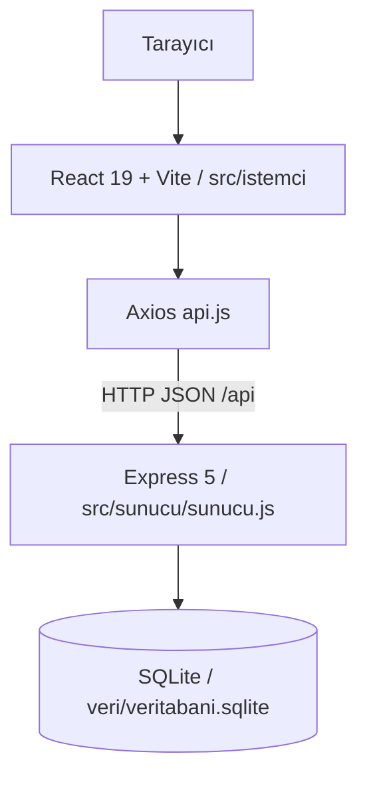

# Sistem Mimarisi

İŞKUR-TAKİP, React/Vite frontend ve Express/SQLite backend'den oluşan tek repository içinde geliştirilen full-stack bir uygulamadır.

## Genel Mimari

## Frontend

Frontend `src/istemci` altındadır. `ana.jsx` uygulamayı başlatır, `Uygulama.jsx` oturum ve rol tabanlı sekmeleri yönetir, `api.js` merkezi API istemcisidir.

## Backend

Backend `src/sunucu` altındadır. `sunucu.js` Express API'yi, `veritabani.js` SQLite bağlantısını, tabloları ve migrasyonları yönetir.

## Ana İş Akışları

### Planlama

Öğrenci haftalık planını gönderir. Sistem en fazla 3 gün ve gün başı 8 saat kuralını kontrol eder. Yönetici planı onaylar veya reddeder.

### Mesai/OTP

Girişte öğrenci kod üretir, yönetici doğrular. Çıkışta yönetici kod üretir, öğrenci doğrular. OTP kodları 5 dakika geçerlidir.

### Puantaj

Puantaj motoru onaylı plan ile attendance kayıtlarını kıyaslar. Yönetici puantaj ekranı Excel benzeri tablo görünümündedir ve toplam devamsızlığı `gelinmeyen gün / sınır` formatında gösterir.

## Tema ve UI

- Ana kurumsal renk: DEÜ lacivert `#00305D`
- Açık ton: `#E6F0FA`
- HTML dili: `tr`
- Türkçe karakter ve uppercase dönüşümleri için `lang="tr"` kullanılır.
